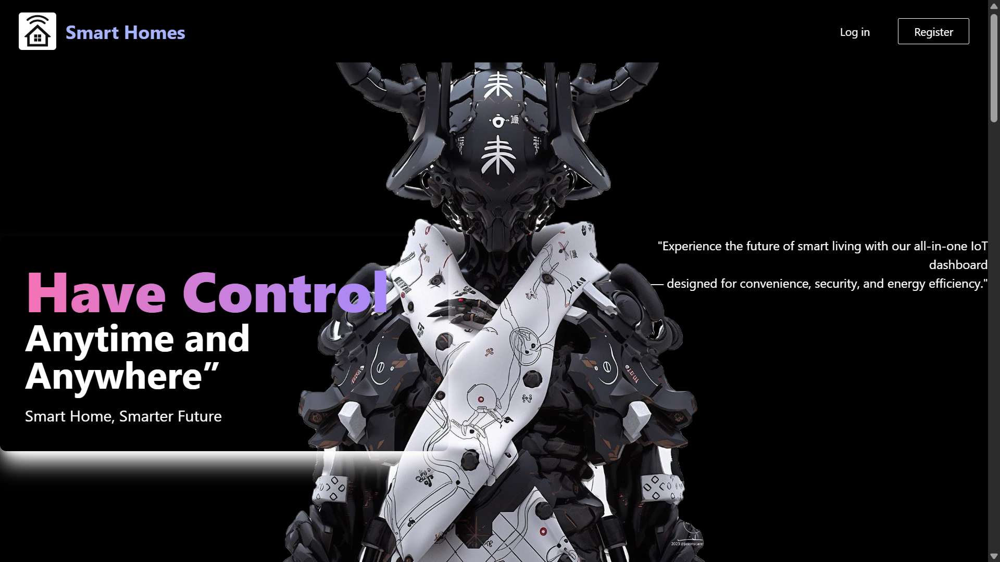
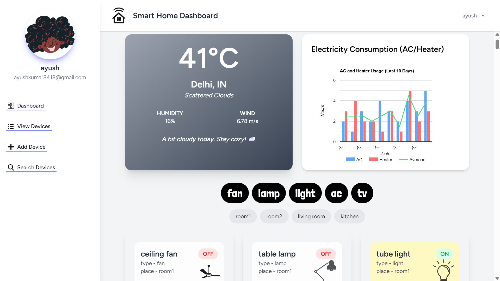
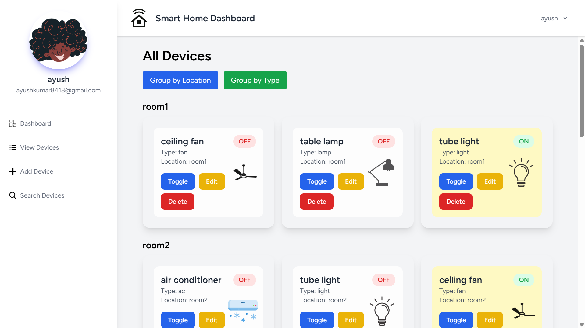
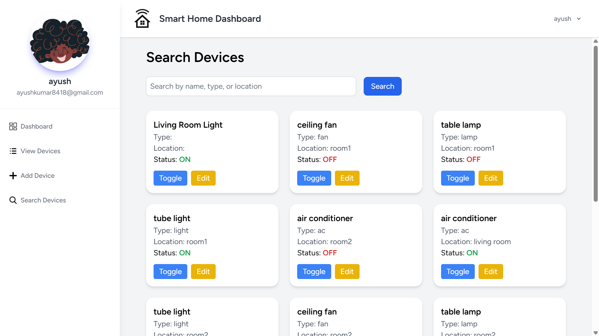
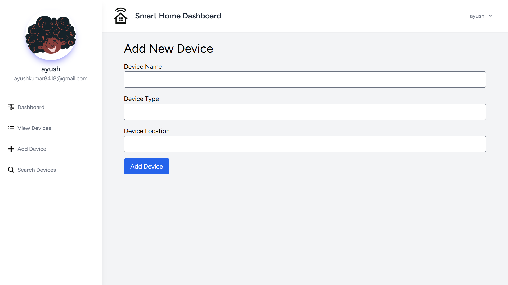
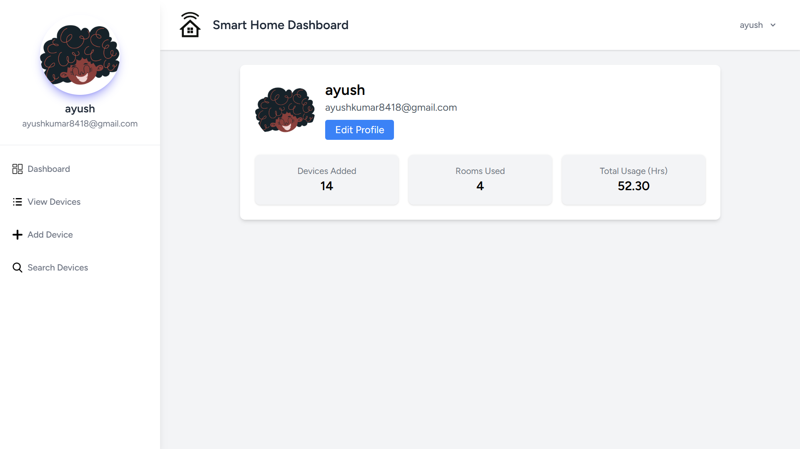

# 🌐 IoT Device Dashboard

A smart, responsive IoT Dashboard built with **Laravel 12**, **MongoDB**, and **Blade**, enabling users to monitor and control home automation devices in real-time. The project demonstrates full-stack capabilities and testable design patterns ideal for backend, frontend, and QA workflows.

---

## 🏗️ Features

- ✅ Smart Device Management (AC, lights, heaters, etc.)
- 📊 Electricity Consumption Graphs (10-day history using Chart.js)
- 🌤️ Live Weather Data using OpenWeatherMap API
- 📱 Device Filters (by Type and Room)
- 👤 User Profiles with Uploadable Avatars
- 🔄 Toggle Device Status with Real-Time Feedback
- 🧩 Dynamic Device Icons and Visual UI Cues
- 🔍 Detailed Device Usage Logs
- 🛡️ Role-based Access (Admin/User)

---

## 🔧 Tech Stack

| Frontend         | Backend      | Database     | Others                                  |
|------------------|--------------|--------------|------------------------------------------|
| Blade (Laravel)  | Laravel 12   | MongoDB      | TailwindCSS, Alpine.js                   |
| HTML/CSS         | PHP          | MongoDB Compass | OpenWeatherMap API, Chart.js, Git, Postman |
| JavaScript       | RESTful Routing |           |                                          |

---

## 💼 Role-Relevant Highlights (Matching CRED SDET JD)

### ✅ Good Technical Skills
- Built with Laravel MVC architecture and follows best practices in component-based design.
- Clean and reusable code structure with real-time form handling and API integration.

### ✅ Automated Test Friendly
- Modular REST endpoints enable easy API testing via Postman or REST Assured.
- Well-structured Blade views and route naming conventions suitable for Playwright or Browser-based testing.
- Device toggles and data inputs are bound with `x-model` (Alpine.js), making UI testing predictable and test-case friendly.

### ✅ APIs and Backend Logic
- Device toggling and weather fetching use REST APIs.
- Separate controllers handle device CRUD, filters, and logs—perfect for automated backend tests.

### ✅ CI/CD and Git Integration
- Entire project is Git-managed.
- Organized folders and `.env` config simplify CI/CD pipeline integration.

### ✅ Strong DSA & Scripting Support
- Backend logic supports extension with efficient data structures.
- Can be extended using Python/Java-based test scripts or shell hooks in pipelines.

---

## 📂 Folder Structure

```bash
iot-dashboard/
├── app/
│   ├── Http/
│   ├── Models/
├── public/
├── resources/
│   ├── views/
│   ├── js/
├── routes/
│   └── web.php
├── database/
├── .env
└── composer.json
```
# 🧪 How to Run & Test
## Clone the Repository:
```bash
git clone https://github.com/Ayush8418/iot2dashboard.git
cd iot2dashboard
```
## Install Dependencies:
```bash
composer install
npm install && npm run dev
```
Environment Setup:
```bash
cp .env.example .env
php artisan key:generate
```
## Database Setup:
1.Configure MongoDB in .env
2.Start MongoDB server and ensure collections are connected

## Run the Server:
php artisan serve
## Start Testing:
1.Use Postman for API testing
2.Use Laravel Dusk, Playwright, or Appium for UI/mobile testing
---

## 📸 Preview
### home

### Dashbord

### devices

### search

### add device

### profile

